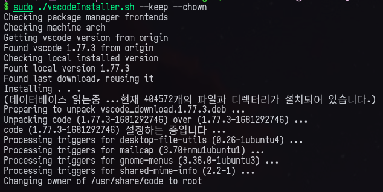

# vscodeInstaller.sh



Fastest, easiest way to install Microsoft offical Visual Studio Code build in linux.

What is included?

+ Auto find package frontend (dpkg, rpm or tar.gz)
+ Auto mechine arch recognize (by uname)
+ Checking installed version and origin version, if same, just exit
+ When have no package frontend, create .desktop file, code command automatically

# Uses

```
$ ./vscodeInstaller.sh --help
-f | --frontend <deb, rpm, tar.gz, auto>
    Set frontend for install vscode. Defualt is auto
-a | --arch <arm64, armhf, x64, auto>
    Target arch, Default is auto (recommended)
-u | --user
    Do not check root permission
-h | --help
    Show this message
--uninstall
    Uninstall vscode
-c | --chown
    Change owner of /usr/share/code folder to qwreey
    This option may useful if you use vscode patch extension
-k | --keep
    Keep .dev .tar.gz .rpm file in cwd
```

## Download script with curl

```
# Download script
curl https://raw.githubusercontent.com/qwreey75/vscodeInstall.sh/master/vscodeInstall.sh -s -o vscodeInstall.sh; chmod a+x vscodeInstall.sh

# Run script
sudo ./vscodeInstall.sh
```

## One line

```
curl https://raw.githubusercontent.com/qwreey75/vscodeInstall.sh/master/vscodeInstall.sh -s | sudo bash
```
